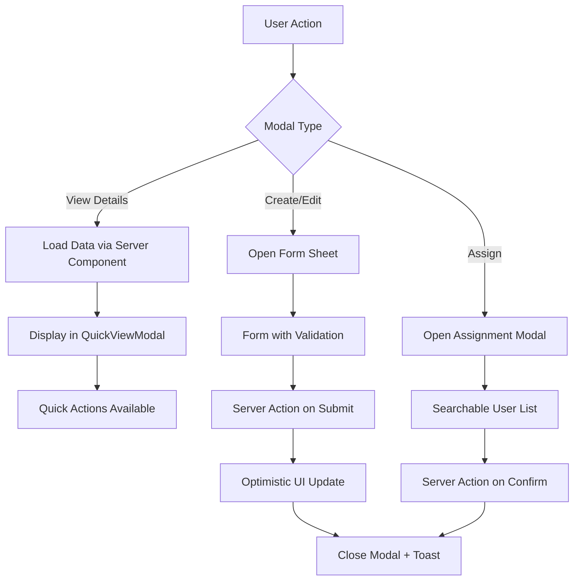

# Design Document

## Overview

This design document outlines the technical approach for implementing modal-based interactions throughout the Fluxera application. The goal is to enhance user experience by reducing full-page navigations, preserving context, and providing fluid interactions for viewing details and managing entities.

The implementation will leverage existing Shadcn UI components (Dialog, Sheet, AlertDialog) built on Radix UI primitives, ensuring accessibility, keyboard navigation, and responsive behavior out of the box.

## Architecture

### Component Hierarchy

```
Modal System
├── Base Components (Shadcn UI - Already Available)
│   ├── Dialog (Center modal)
│   ├── Sheet (Slide-in panel)
│   └── AlertDialog (Confirmation)
│
├── Specialized Modal Components (To Be Created)
│   ├── QuickViewModal (Entity details)
│   ├── FormSheet (Create/Edit forms)
│   ├── AssignmentModal (User/Asset assignment)
│   ├── BulkActionModal (Bulk operations)
│   └── ExpandedWidgetModal (Dashboard widgets)
│
└── Modal Management
    ├── useModalState (State management hook)
    ├── useUnsavedChanges (Dirty form detection)
    └── useKeyboardNavigation (Arrow key navigation)
```

### State Management Strategy

**URL-based State (Preferred for Deep Linking)**
- Use Next.js searchParams for modal state when deep linking is desired
- Example: `/assets?view=123` opens asset detail modal
- Allows sharing URLs that open specific modals

**Component State (For Transient Modals)**
- Use React state for temporary modals (confirmations, assignments)
- No URL pollution for ephemeral interactions
- Simpler implementation for quick actions

**Form State**
- React Hook Form for all form modals
- Dirty state tracking for unsaved changes warnings
- Optimistic UI updates on success

### Data Flow



## Components and Interfaces

### 1. QuickViewModal Component

**Purpose**: Display entity details in a modal without navigation

**Props Interface**:
```typescript
interface QuickViewModalProps<T> {
  open: boolean;
  onOpenChange: (open: boolean) => void;
  title: string;
  data: T;
  loading?: boolean;
  actions?: QuickAction[];
  onNavigate?: (direction: 'prev' | 'next') => void;
  children: React.ReactNode;
}

interface QuickAction {
  label: string;
  icon?: React.ComponentType;
  onClick: () => void;
  variant?: 'default' | 'destructive' | 'outline';
  disabled?: boolean;
}
```

**Features**:
- Configurable size (sm, md, lg, xl)
- Quick action buttons in header
- Keyboard navigation (Escape to close, Arrow keys for prev/next)
- Loading states
- Responsive layout

**Usage Example**:
```typescript
<QuickViewModal
  open={isOpen}
  onOpenChange={setIsOpen}
  title={asset.name}
  data={asset}
  actions={[
    { label: 'Edit', icon: Edit, onClick: handleEdit },
    { label: 'Assign', icon: UserPlus, onClick: handleAssign },
    { label: 'Delete', icon: Trash, onClick: handleDelete, variant: 'destructive' }
  ]}
  onNavigate={handleNavigate}
>
  <AssetDetailsContent asset={asset} />
</QuickViewModal>
```

### 2. FormSheet Component

**Purpose**: Slide-in panel for create/edit forms

**Props Interface**:
```typescript
interface FormSheetProps {
  open: boolean;
  onOpenChange: (open: boolean) => void;
  title: string;
  description?: string;
  side?: 'left' | 'right' | 'top' | 'bottom';
  size?: 'sm' | 'md' | 'lg' | 'xl';
  children: React.ReactNode;
  onSubmit?: () => void;
  submitLabel?: string;
  cancelLabel?: string;
  loading?: boolean;
  dirty?: boolean; // For unsaved changes warning
}
```

**Features**:
- Configurable slide direction and size
- Unsaved changes warning on close
- Form submission handling
- Loading states during submission
- Sticky header and footer
- Scroll management

**Usage Example**:
```typescript
<FormSheet
  open={isOpen}
  onOpenChange={setIsOpen}
  title="Create New Asset"
  description="Add a new asset to your inventory"
  side="right"
  size="lg"
  dirty={form.formState.isDirty}
>
  <CreateAssetForm onSuccess={() => setIsOpen(false)} />
</FormSheet>
```

### 3. AssignmentModal Component

**Purpose**: Specialized modal for assigning assets/licenses to users

**Props Interface**:
```typescript
interface AssignmentModalProps {
  open: boolean;
  onOpenChange: (open: boolean) => void;
  entityType: 'asset' | 'license';
  entityId: string;
  entityName: string;
  currentAssignee?: {
    id: string;
    name: string;
    email: string;
  };
  onAssign: (userId: string) => Promise<void>;
  onUnassign?: () => Promise<void>;
}
```

**Features**:
- Real-time user search with debouncing
- Current assignment display
- Reassignment warning
- Unassignment option
- Loading states

### 4. BulkActionModal Component

**Purpose**: Handle bulk operations with progress tracking

**Props Interface**:
```typescript
interface BulkActionModalProps {
  open: boolean;
  onOpenChange: (open: boolean) => void;
  action: string;
  itemCount: number;
  items: Array<{ id: string; name: string }>;
  onConfirm: (itemIds: string[]) => Promise<BulkActionResult>;
  destructive?: boolean;
}

interface BulkActionResult {
  successful: string[];
  failed: Array<{ id: string; error: string }>;
}
```

**Features**:
- Confirmation with item preview
- Progress indicator during execution
- Results summary with success/failure breakdown
- Cancellation support
- Error details for failed items

### 5. ExpandedWidgetModal Component

**Purpose**: Display dashboard widgets in expanded view

**Props Interface**:
```typescript
interface ExpandedWidgetModalProps {
  open: boolean;
  onOpenChange: (open: boolean) => void;
  title: string;
  widget: WidgetConfig;
  data: any;
  filters?: FilterConfig[];
  onExport?: (format: 'csv' | 'pdf') => void;
}
```

**Features**:
- Full-screen or large modal
- Interactive filters
- Real-time data updates
- Export functionality
- Responsive charts and tables

## Data Models

### Modal State Management

```typescript
// URL-based modal state
interface ModalSearchParams {
  view?: string;      // Entity ID to view
  action?: 'create' | 'edit' | 'assign';
  entity?: 'asset' | 'license' | 'user';
}

// Component state
interface ModalState {
  isOpen: boolean;
  entityId?: string;
  mode?: 'view' | 'edit' | 'create';
}

// Form state with dirty tracking
interface FormModalState<T> {
  isOpen: boolean;
  data?: T;
  isDirty: boolean;
  isSubmitting: boolean;
  error?: string;
}
```

### Context Preservation

```typescript
interface ListViewContext {
  scrollPosition: number;
  filters: Record<string, any>;
  searchTerm: string;
  sortBy: string;
  sortOrder: 'asc' | 'desc';
  selectedIds: string[];
}

// Stored in sessionStorage or React state
const preserveContext = (context: ListViewContext) => {
  sessionStorage.setItem('listViewContext', JSON.stringify(context));
};

const restoreContext = (): ListViewContext | null => {
  const stored = sessionStorage.getItem('listViewContext');
  return stored ? JSON.parse(stored) : null;
};
```

## Correctness Properties

*A property is a characteristic or behavior that should hold true across all valid executions of a system-essentially, a formal statement about what the system should do. Properties serve as the bridge between human-readable specifications and machine-verifiable correctness guarantees.*

### Property 1: Context Preservation Round Trip
*For any* list view with filters, search terms, and scroll position, opening and closing a modal should restore the exact same view state
**Validates: Requirements 1.2, 1.3, 7.5**

### Property 2: Modal Opens with Complete Data
*For any* entity (asset, license, user), clicking to view details should display a modal containing all required fields for that entity type
**Validates: Requirements 1.1, 1.4, 4.1, 4.2**

### Property 3: Quick Actions Present
*For any* detail modal, the required quick action buttons (edit, assign, delete, etc.) should be rendered and accessible
**Validates: Requirements 1.5, 4.4**

### Property 4: Sheet Opens on Action
*For any* create or edit action, clicking the trigger button should display a slide-in sheet with the appropriate form
**Validates: Requirements 2.1, 3.1, 6.1, 6.3**

### Property 5: Background Dimming
*For any* open modal or sheet, the background content should have an overlay with reduced opacity
**Validates: Requirements 2.2**

### Property 6: Success Sequence Completion
*For any* successful create, edit, or assignment operation, the system should close the modal, display a success notification, and refresh the affected list
**Validates: Requirements 2.3, 3.3, 5.3, 6.5**

### Property 7: Unsaved Changes Warning
*For any* form modal with modified fields, attempting to close should display a confirmation dialog before discarding changes
**Validates: Requirements 2.4, 3.4**

### Property 8: Real-time Validation Feedback
*For any* form field with validation rules, errors should display inline immediately after the field loses focus or on submission attempt
**Validates: Requirements 2.5, 3.2, 3.5**

### Property 9: Email Validation and Duplicate Check
*For any* user invitation, the system should validate email format and check for existing users before allowing submission
**Validates: Requirements 6.2**

### Property 10: Role Change Confirmation
*For any* user role modification, the system should display a confirmation dialog explaining the permission changes
**Validates: Requirements 6.4**

### Property 11: Expiring License Highlighting
*For any* license expiring within 30 days, the expiration date should be visually highlighted in the detail modal
**Validates: Requirements 4.3**

### Property 12: Keyboard Navigation Between Entities
*For any* entity in a list with an open detail modal, pressing arrow keys should navigate to the adjacent entity's details
**Validates: Requirements 4.5**

### Property 13: Assignment Modal with Search
*For any* assignable entity, clicking assign should open a modal with a searchable user list that filters in real-time
**Validates: Requirements 5.1, 5.2**

### Property 14: Current Assignment Display
*For any* already-assigned entity, the assignment modal should show the current assignee and provide an unassign option
**Validates: Requirements 5.5**

### Property 15: Dashboard Widget Expansion
*For any* dashboard widget, clicking should open a modal with expanded data, filters, and export functionality
**Validates: Requirements 7.1, 7.2, 7.4**

### Property 16: Real-time Filter Updates
*For any* filter change in an expanded dashboard modal, the visualizations should update immediately
**Validates: Requirements 7.3**

### Property 17: Bulk Action Confirmation
*For any* bulk action on selected items, the system should display a confirmation modal with action details and item count
**Validates: Requirements 8.1**

### Property 18: Bulk Action Progress Tracking
*For any* bulk operation, the system should display a progress indicator that accurately reflects the number of items processed
**Validates: Requirements 8.2**

### Property 19: Bulk Action Results Summary
*For any* completed bulk action, the system should display a summary showing successful and failed operations with error details
**Validates: Requirements 8.3, 8.4**

### Property 20: Bulk Action Cancellation
*For any* in-progress bulk operation, a cancel button should be available and functional
**Validates: Requirements 8.5**

### Property 21: Responsive Layout Adaptation
*For any* modal displayed on different viewport sizes, the layout should adapt without content overflow or horizontal scrolling
**Validates: Requirements 9.1**

### Property 22: Modal Focus Trap
*For any* open modal, keyboard focus should remain trapped within the modal, cycling through focusable elements
**Validates: Requirements 9.2**

### Property 23: Multiple Close Methods
*For any* modal, closing should work via Escape key, close button, and clicking outside the modal (for non-critical modals)
**Validates: Requirements 9.3**

### Property 24: Screen Reader Announcements
*For any* modal opening, screen readers should announce the modal with appropriate ARIA labels and role
**Validates: Requirements 9.4**

### Property 25: Form Keyboard Accessibility
*For any* form modal, all fields should be keyboard accessible with proper labels and tab order
**Validates: Requirements 9.5**

### Property 26: Animation Timing Consistency
*For any* modal open or close transition, the animation should complete within 200-300ms
**Validates: Requirements 10.1**

### Property 27: Loading State Display
*For any* modal loading async data, a loading indicator should be visible in the content area
**Validates: Requirements 10.2**

### Property 28: Modal Z-Index Stacking
*For any* sequence of modal openings, each new modal should have a higher z-index than the previous
**Validates: Requirements 10.4**

### Property 29: Body Scroll Lock with Position Preservation
*For any* open modal, the body should not scroll, and the scroll position should be restored when the modal closes
**Validates: Requirements 10.5**

### Property 30: Component Size Variants
*For any* base Modal component, all size options (sm, md, lg, xl, full) should render with correct dimensions
**Validates: Requirements 11.1**

### Property 31: Sheet Direction Variants
*For any* Sheet component, all side options (left, right, top, bottom) should render with correct slide direction
**Validates: Requirements 11.2**

### Property 32: Help Tooltips with Delay
*For any* complex form field with a help icon, hovering should display a tooltip after 500ms
**Validates: Requirements 12.1, 12.2**

### Property 33: Multi-step Progress Indicators
*For any* multi-step modal process, progress indicators and step descriptions should be visible
**Validates: Requirements 12.3**

### Property 34: Actionable Error Messages
*For any* validation error, the error message should be non-empty and provide guidance for correction
**Validates: Requirements 12.4**

## Error Handling

### Error Boundaries

Each modal type will have error boundary protection:

```typescript
<ErrorBoundary
  fallback={<ModalErrorFallback onClose={handleClose} />}
  onError={logModalError}
>
  <QuickViewModal {...props} />
</ErrorBoundary>
```

### Error States

**Loading Errors**:
- Display error message in modal content area
- Provide retry button
- Allow closing modal

**Submission Errors**:
- Display inline error messages
- Highlight problematic fields
- Keep modal open for correction
- Provide actionable error messages

**Network Errors**:
- Toast notification for transient errors
- Inline error for persistent issues
- Automatic retry with exponential backoff

### Validation Errors

```typescript
interface ValidationError {
  field: string;
  message: string;
  code: string;
}

// Display inline with form fields
<FormMessage>{error.message}</FormMessage>

// Aggregate errors at top of form
<Alert variant="destructive">
  <AlertTitle>Please correct the following errors:</AlertTitle>
  <AlertDescription>
    <ul>
      {errors.map(e => <li key={e.field}>{e.message}</li>)}
    </ul>
  </AlertDescription>
</Alert>
```

## Testing Strategy

### Unit Tests

**Modal Component Tests**:
- Rendering with different props
- Open/close behavior
- Keyboard interactions (Escape, Tab, Arrow keys)
- Focus trap functionality
- Responsive behavior

**Hook Tests**:
- useModalState state transitions
- useUnsavedChanges dirty detection
- useKeyboardNavigation event handling

**Form Tests**:
- Validation logic
- Submission handling
- Error display
- Dirty state tracking

### Integration Tests

**Modal Workflows**:
- Open asset detail → Edit → Save → Close
- Create asset → Validation error → Correct → Submit
- Bulk select → Confirm → Progress → Results
- Search users → Select → Assign → Success

**Context Preservation**:
- Apply filters → Open modal → Close → Verify filters restored
- Scroll list → Open modal → Close → Verify scroll position
- Select items → Open modal → Close → Verify selection maintained

### E2E Tests (Playwright)

**User Flows**:
```typescript
test('view asset details in modal', async ({ page }) => {
  await page.goto('/home/test-account/assets');
  await page.click('[data-test="asset-row-1"]');
  await expect(page.locator('[role="dialog"]')).toBeVisible();
  await expect(page.locator('[role="dialog"]')).toContainText('Asset Name');
  await page.keyboard.press('Escape');
  await expect(page.locator('[role="dialog"]')).not.toBeVisible();
});

test('create asset with form sheet', async ({ page }) => {
  await page.goto('/home/test-account/assets');
  await page.click('[data-test="create-asset-button"]');
  await expect(page.locator('[role="dialog"]')).toBeVisible();
  await page.fill('[data-test="asset-name-input"]', 'Test Laptop');
  await page.selectOption('[data-test="asset-category-select"]', 'laptop');
  await page.click('[data-test="submit-create-asset-button"]');
  await expect(page.locator('[role="dialog"]')).not.toBeVisible();
  await expect(page.locator('text=Test Laptop')).toBeVisible();
});

test('unsaved changes warning', async ({ page }) => {
  await page.goto('/home/test-account/assets');
  await page.click('[data-test="create-asset-button"]');
  await page.fill('[data-test="asset-name-input"]', 'Test');
  await page.keyboard.press('Escape');
  await expect(page.locator('text=unsaved changes')).toBeVisible();
});
```

**Accessibility Tests**:
```typescript
test('modal keyboard navigation', async ({ page }) => {
  await page.goto('/home/test-account/assets');
  await page.click('[data-test="asset-row-1"]');
  
  // Focus should be trapped in modal
  await page.keyboard.press('Tab');
  const focusedElement = await page.evaluate(() => document.activeElement?.tagName);
  expect(focusedElement).not.toBe('BODY');
  
  // Escape should close
  await page.keyboard.press('Escape');
  await expect(page.locator('[role="dialog"]')).not.toBeVisible();
});

test('screen reader announcements', async ({ page }) => {
  await page.goto('/home/test-account/assets');
  await page.click('[data-test="asset-row-1"]');
  
  const dialog = page.locator('[role="dialog"]');
  await expect(dialog).toHaveAttribute('aria-labelledby');
  await expect(dialog).toHaveAttribute('aria-describedby');
});
```

### Performance Tests

**Modal Opening Performance**:
- Measure time from click to modal visible
- Target: < 100ms for empty modal, < 300ms with data

**Animation Performance**:
- Monitor frame rate during transitions
- Target: 60fps for all animations

**Memory Leaks**:
- Open/close modals repeatedly
- Monitor memory usage
- Ensure proper cleanup of event listeners and timers

## Implementation Details

### File Structure

```
apps/web/app/home/[account]/
├── assets/
│   ├── _components/
│   │   ├── asset-quick-view-modal.tsx
│   │   ├── create-asset-sheet.tsx
│   │   ├── edit-asset-sheet.tsx
│   │   └── assign-asset-modal.tsx
│   └── page.tsx
│
├── licenses/
│   ├── _components/
│   │   ├── license-quick-view-modal.tsx
│   │   ├── create-license-sheet.tsx
│   │   └── assign-license-modal.tsx
│   └── page.tsx
│
└── users/
    ├── _components/
    │   ├── invite-user-modal.tsx
    │   └── edit-user-modal.tsx
    └── page.tsx

packages/ui/src/
├── modal/
│   ├── quick-view-modal.tsx
│   ├── form-sheet.tsx
│   ├── assignment-modal.tsx
│   ├── bulk-action-modal.tsx
│   └── expanded-widget-modal.tsx
│
└── hooks/
    ├── use-modal-state.ts
    ├── use-unsaved-changes.ts
    ├── use-keyboard-navigation.ts
    └── use-context-preservation.ts
```

### Hooks Implementation

**useModalState**:
```typescript
export function useModalState(initialOpen = false) {
  const [isOpen, setIsOpen] = useState(initialOpen);
  const [entityId, setEntityId] = useState<string | undefined>();

  const open = useCallback((id?: string) => {
    setEntityId(id);
    setIsOpen(true);
  }, []);

  const close = useCallback(() => {
    setIsOpen(false);
    setEntityId(undefined);
  }, []);

  return { isOpen, entityId, open, close };
}
```

**useUnsavedChanges**:
```typescript
export function useUnsavedChanges(isDirty: boolean) {
  const [showWarning, setShowWarning] = useState(false);
  const [pendingClose, setPendingClose] = useState(false);

  const handleClose = useCallback(() => {
    if (isDirty) {
      setShowWarning(true);
      setPendingClose(true);
      return false;
    }
    return true;
  }, [isDirty]);

  const confirmClose = useCallback(() => {
    setShowWarning(false);
    setPendingClose(false);
    return true;
  }, []);

  const cancelClose = useCallback(() => {
    setShowWarning(false);
    setPendingClose(false);
  }, []);

  return { showWarning, handleClose, confirmClose, cancelClose };
}
```

**useKeyboardNavigation**:
```typescript
export function useKeyboardNavigation(
  items: Array<{ id: string }>,
  currentId: string | undefined,
  onNavigate: (id: string) => void
) {
  useEffect(() => {
    if (!currentId) return;

    const handleKeyDown = (e: KeyboardEvent) => {
      const currentIndex = items.findIndex(item => item.id === currentId);
      
      if (e.key === 'ArrowLeft' || e.key === 'ArrowUp') {
        e.preventDefault();
        const prevIndex = currentIndex > 0 ? currentIndex - 1 : items.length - 1;
        onNavigate(items[prevIndex].id);
      } else if (e.key === 'ArrowRight' || e.key === 'ArrowDown') {
        e.preventDefault();
        const nextIndex = currentIndex < items.length - 1 ? currentIndex + 1 : 0;
        onNavigate(items[nextIndex].id);
      }
    };

    window.addEventListener('keydown', handleKeyDown);
    return () => window.removeEventListener('keydown', handleKeyDown);
  }, [items, currentId, onNavigate]);
}
```

### Animation Configuration

```typescript
// Tailwind animation classes
const modalAnimations = {
  overlay: {
    enter: 'animate-in fade-in-0 duration-200',
    exit: 'animate-out fade-out-0 duration-200',
  },
  content: {
    enter: 'animate-in fade-in-0 zoom-in-95 duration-200',
    exit: 'animate-out fade-out-0 zoom-out-95 duration-200',
  },
  sheet: {
    right: {
      enter: 'animate-in slide-in-from-right duration-300',
      exit: 'animate-out slide-out-to-right duration-300',
    },
    left: {
      enter: 'animate-in slide-in-from-left duration-300',
      exit: 'animate-out slide-out-to-left duration-300',
    },
  },
};
```

### Accessibility Implementation

**ARIA Attributes**:
```typescript
<Dialog
  role="dialog"
  aria-labelledby="modal-title"
  aria-describedby="modal-description"
  aria-modal="true"
>
  <DialogTitle id="modal-title">{title}</DialogTitle>
  <DialogDescription id="modal-description">{description}</DialogDescription>
  {children}
</Dialog>
```

**Focus Management**:
```typescript
useEffect(() => {
  if (isOpen) {
    // Store currently focused element
    const previouslyFocused = document.activeElement as HTMLElement;
    
    // Focus first focusable element in modal
    const firstFocusable = modalRef.current?.querySelector(
      'button, [href], input, select, textarea, [tabindex]:not([tabindex="-1"])'
    ) as HTMLElement;
    firstFocusable?.focus();
    
    return () => {
      // Restore focus on close
      previouslyFocused?.focus();
    };
  }
}, [isOpen]);
```

**Keyboard Shortcuts**:
- `Escape`: Close modal
- `Tab`: Navigate forward through focusable elements
- `Shift+Tab`: Navigate backward
- `Arrow Left/Up`: Previous item (in quick view)
- `Arrow Right/Down`: Next item (in quick view)
- `Enter`: Submit form (when focused on submit button)

### Performance Optimizations

**Lazy Loading**:
```typescript
const QuickViewModal = lazy(() => import('./quick-view-modal'));
const FormSheet = lazy(() => import('./form-sheet'));

// Use with Suspense
<Suspense fallback={<LoadingSpinner />}>
  <QuickViewModal {...props} />
</Suspense>
```

**Debounced Search**:
```typescript
const debouncedSearch = useMemo(
  () => debounce((term: string) => {
    searchUsers(term);
  }, 300),
  []
);
```

**Optimistic Updates**:
```typescript
const handleAssign = async (userId: string) => {
  // Optimistically update UI
  setOptimisticAssignee(users.find(u => u.id === userId));
  
  try {
    await assignAsset(assetId, userId);
    // Success - optimistic update was correct
  } catch (error) {
    // Revert optimistic update
    setOptimisticAssignee(null);
    toast.error('Failed to assign asset');
  }
};
```

## Migration Strategy

### Phase 1: Core Modal Components
1. Create base modal components in packages/ui
2. Implement hooks for state management
3. Add comprehensive tests
4. Document usage patterns

### Phase 2: Asset Management
1. Convert asset detail page to QuickViewModal
2. Convert create asset page to FormSheet
3. Implement assign asset modal
4. Update E2E tests

### Phase 3: License Management
1. Convert license detail to QuickViewModal
2. Convert create/edit to FormSheet
3. Implement assignment modal
4. Update E2E tests

### Phase 4: User Management
1. Implement invite user modal
2. Implement edit user modal
3. Implement role change confirmation
4. Update E2E tests

### Phase 5: Dashboard & Bulk Actions
1. Implement expanded widget modals
2. Implement bulk action modals
3. Add export functionality
4. Update E2E tests

### Phase 6: Polish & Optimization
1. Performance optimization
2. Accessibility audit
3. Animation refinement
4. Documentation completion

## Dependencies

### Existing Dependencies (Already Installed)
- `@radix-ui/react-dialog` - Base dialog primitives
- `@radix-ui/react-icons` - Icons for close buttons
- `radix-ui` - Core Radix UI package
- `class-variance-authority` - Variant management
- `tailwindcss-animate` - Animation utilities

### New Dependencies (If Needed)
- None - all required functionality available with existing stack

## Browser Support

- Chrome/Edge: Latest 2 versions
- Firefox: Latest 2 versions
- Safari: Latest 2 versions
- Mobile Safari: iOS 14+
- Chrome Mobile: Latest version

## Responsive Breakpoints

```typescript
const modalSizes = {
  sm: 'max-w-sm',   // 384px
  md: 'max-w-md',   // 448px
  lg: 'max-w-lg',   // 512px
  xl: 'max-w-xl',   // 576px
  '2xl': 'max-w-2xl', // 672px
  full: 'max-w-full', // 100%
};

// Mobile adaptations
const mobileStyles = {
  // Full screen on mobile for large modals
  lg: 'max-w-lg sm:max-w-full',
  // Bottom sheet on mobile
  sheet: 'sm:inset-x-0 sm:bottom-0 sm:top-auto',
};
```
